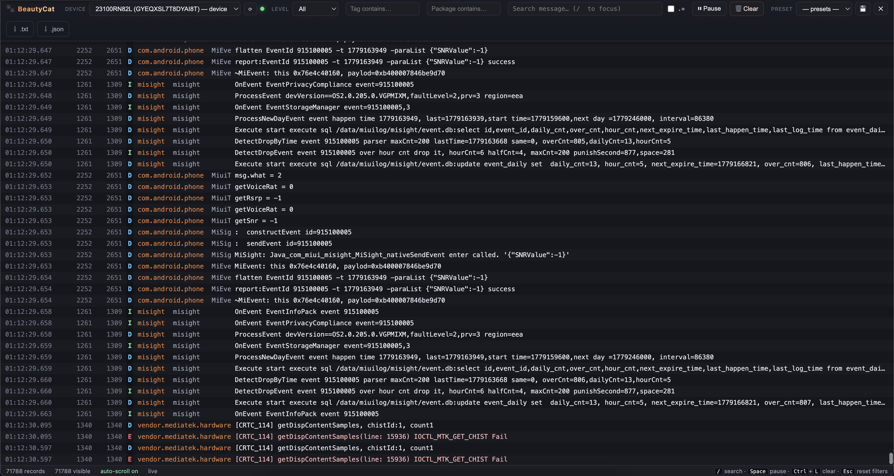

# 🐾 BeautyCat



A beautiful, web-based `adb logcat` viewer — Android Studio's Logcat without the IDE.

BeautyCat wraps `adb logcat`, streams logs to your browser over WebSocket, and gives
you a fast dark IDE-like UI with level/tag/package filters, regex search, pause/resume,
filter presets, and one-click export. Single command to start. No IDE required.

## Features

- 🔌 Multi-device support (auto-detects `adb devices`, switch on the fly)
- 🎚️ Level filter (V/D/I/W/E/A — inclusive minimum, like Android Studio)
- 🏷️ Tag, package, and PID filters
- 🔎 Search with optional regex and inline highlighting
- ⏯️ Pause / resume / clear (clears device buffer + UI)
- 🔒 Auto-scroll lock — pins to bottom unless you scroll up
- 💾 Named filter presets persisted at `~/.beautycat/presets.json`
- ⬇️ Export current view as `.txt` (logcat format) or `.json`
- ⌨️ Keyboard shortcuts (`/` search · `Space` pause · `Ctrl+L` clear · `Esc` reset)
- 🧵 Stack-trace folding — multi-line records collapse to one row; click to expand
- 🛰️ PID → package name resolution via `adb shell ps`

## Requirements

- macOS or Linux
- Python 3.10+
- `adb` (Android platform-tools). On macOS, `~/Library/Android/sdk/platform-tools/adb`
  is auto-detected if not on `PATH`.

## Install

```bash
./install.sh
```

The installer auto-detects `pipx` (preferred) or falls back to a dedicated venv at
`~/.beautycat/venv`. Either way, you get a `beautycat` command on your `PATH`.

Other modes:

```bash
./install.sh --venv         # force the venv method
./install.sh --upgrade      # reinstall, replacing any prior install
./install.sh --uninstall    # remove BeautyCat
./install.sh --prefix DIR   # override install location (default: ~/.beautycat)
```

## Usage

Plug in a device (or start an emulator), then:

```bash
beautycat
```

The browser opens at <http://127.0.0.1:8099> and streaming starts as soon as you
pick a device.

Flags:

| Flag             | Default       | Notes                                    |
|------------------|---------------|------------------------------------------|
| `--port`         | `8099`        | Port to bind                             |
| `--host`         | `127.0.0.1`   | Bind address (use `0.0.0.0` for LAN)     |
| `--buffer-size`  | `10000`       | Records per device kept in memory        |
| `--adb-path`     | auto          | Path to `adb` if not on `PATH`           |
| `--no-browser`   | off           | Don't open the browser                   |
| `--log-level`    | `warning`     | Server log verbosity                     |

## Keyboard shortcuts

| Key              | Action                |
|------------------|-----------------------|
| `/`              | Focus the search box  |
| `Space`          | Pause / resume        |
| `Ctrl + L`       | Clear logs            |
| `Esc`            | Reset all filters     |
| Click on a row   | Expand / collapse     |

## How it works

```
adb -s SERIAL logcat -v threadtime    ← async subprocess
        │
        ▼
   parser (LogcatParser)               ← stateful; merges continuation lines into the previous record
        │
        ▼
   ring buffer (deque, maxlen=N)       ← per-device
        │
        ├─► resolver enriches record.package from `adb shell ps` (refreshed every 2s)
        │
        ▼
   WebSocket /ws/{serial}              ← snapshot + batched appends every ~50ms
        │
        ▼
   browser (vanilla JS, virtual-scroll)
```

## Development

```bash
python3 -m venv .venv
source .venv/bin/activate
pip install -e ".[dev]"
pytest -q
beautycat --log-level debug
```

## License

MIT
